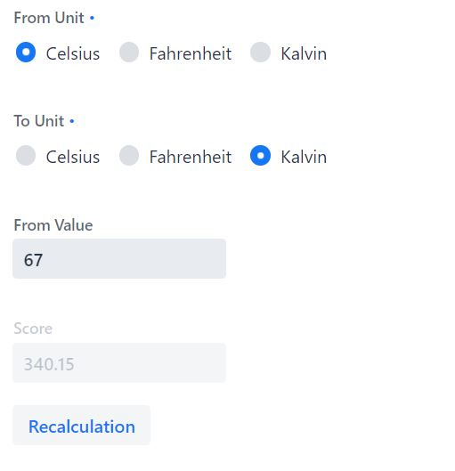

# temperature-converter

## Table of contents
* [General info](#general-info)
* [Technologies](#technologies)
* [Screenshots](#screenshots)
* [Installation](#installation)
* [Status](#status)

## General info
Temperature converter which automatically converts between Celsius, Fahrenheit, Kalvin.

## Technologies
* [Spring Boot] - version 2.1.6
* [Vaadin] - version 14.0.1

## Screenshots

### Register Page



## Installation
This app is a Spring Boot application built using Maven. You can build a jar file and run it from the command line:

git clone https://github.com/martadrabik-dabrowska/temperature-converter
```sh
cd temperature-converter
./mvnw package
java -jar target/*.jar
```

You can then access app here: http://localhost:8090/

## Status
Project is: _in progress_

License
----

MIT


[Spring Boot]: <https://spring.io/projects/spring-boot>
[Vaadin]: <https://vaadin.com/releases>

